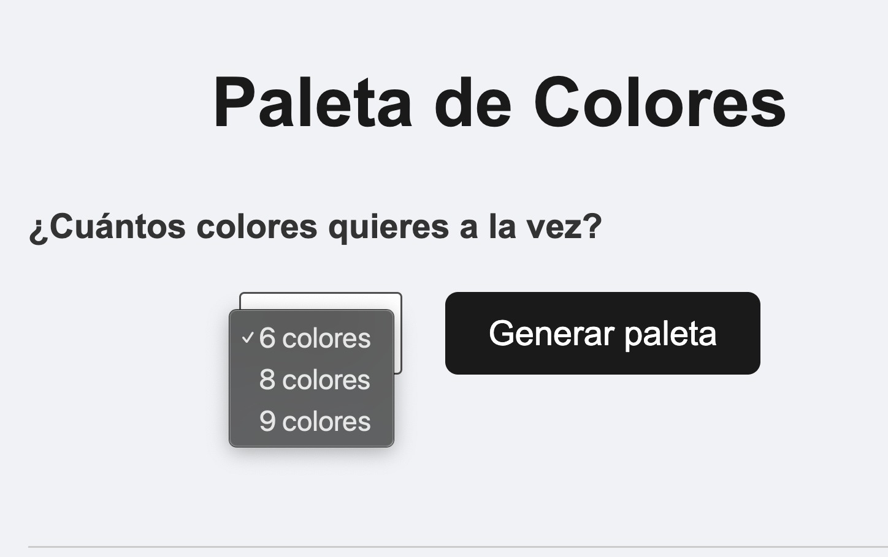
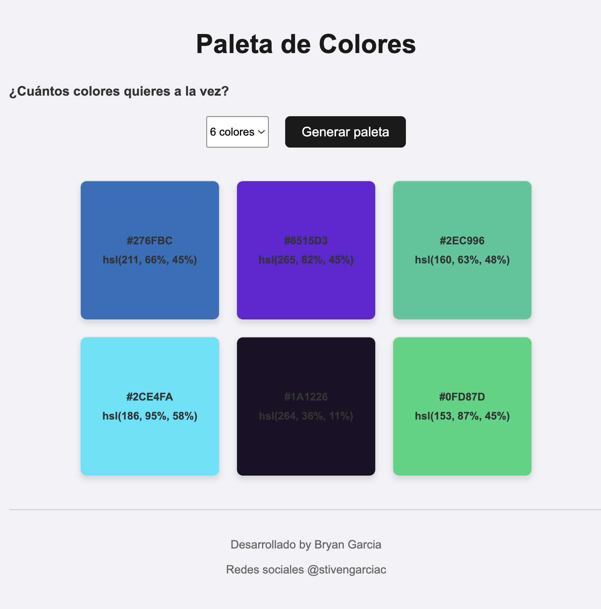

## Paleta de Colores — Proyecto Módulo 1

Proyecto desarrollado por Bryan García como evaluación final del Módulo 1 (HTML, CSS y JavaScript) en SoyHenry.

## 1. Descripción

Esta aplicación web genera paletas de colores aleatorias para ayudar a diseñadores y desarrolladores a explorar combinaciones de color de forma rápida. El usuario elige cuántos colores quiere ver a la vez (6, 8 o 9) y, al presionar el botón "Generar paleta", la aplicación crea esa cantidad de cajas de color, cada una mostrando su código en dos formatos: HEX y HSL. Cada nueva generación reemplaza la paleta anterior, permitiendo explorar combinaciones ilimitadas con un solo clic.

## 2. Captura de pantalla

## 3. Herramientas utilizadas
- HTML5 — estructura semántica de la página.
- CSS3 — estilos visuales, diseño con Flexbox.
- JavaScript (Vanilla JS) — lógica de generación de colores y manipulación del DOM, sin frameworks ni librerías externas.
- Claude (IA de Anthropic) — usado como apoyo de aprendizaje durante el desarrollo.
- Git y GitHub — control de versiones y despliegue con GitHub Pages.

## 4. Características
- Generación de colores completamente aleatoria en cada clic.
- Doble formato de color: HEX y su equivalente calculado en HSL.
- Selección de tamaño de paleta mediante un menú desplegable (6, 8 o 9 colores).
- Renderizado dinámico: las cajas de color no existen en el HTML de antemano, se crean con JavaScript en tiempo real.
- Diseño limpio, adaptado para escritorio.
- Sin dependencias externas: funciona abriendo directamente el index.html.
- Microfeedback visual: al hacer clic sobre una caja de color, se copia su código HEX al portapapeles y aparece un mensaje de confirmación ("¡Color copiado!").
- Contraste automático de texto: el color del texto (blanco o negro) se calcula dinámicamente según qué tan claro u oscuro sea el color de fondo generado, garantizando legibilidad.
- Navegación accesible por teclado: tanto los controles como las cajas de color pueden recibir foco mediante la tecla Tab, con un indicador visual claro.

## 5. Estructura del proyecto
ProyectoM1_BryanGarcia/
├── Desarrollo/
│   ├── index.html       
│   ├── style.css         
│   └── script.js         
└── Documentacion/
    ├── README.md
    └──imagenes/                   

## 6. Cómo utilizar la aplicación
- Abre el archivo index.html en tu navegador (o entra al link de la demo).
- Selecciona en el menú desplegable cuántos colores quieres generar: 6, 8 o 9.
- Presiona el botón "Generar paleta".
- Aparecerán las cajas de color en pantalla, cada una mostrando su código HEX y su valor HSL.
- Puedes presionar "Generar paleta" las veces que quieras: cada clic genera una combinación nueva y reemplaza la anterior.

## 7. Funcionalidades principales
- Generación aleatoria de color (HEX): se construye un código hexadecimal de 6 caracteres eligiendo al azar entre 0123456789ABCDEF.
- Conversión a HSL: cada color generado en HEX se convierte matemáticamente a su equivalente HSL (Matiz, Saturación, Luminosidad), pasando primero por RGB.
- Selección de cantidad: un <select> permite elegir el tamaño de la paleta sin disparar ninguna acción hasta presionar "Generar paleta".
- Renderizado dinámico del DOM: por cada color generado, se crea un 
 nuevo con document.createElement, se le asigna el color de fondo y el texto correspondiente, y se inserta en el contenedor de la paleta.
- Reemplazo de resultados: antes de generar una nueva paleta, se limpia el contenedor anterior (innerHTML = ""), evitando que las cajas se acumulen entre clics.
- Copiado al portapapeles con feedback visual: cada caja de color tiene su propio evento de clic que copia el código HEX usando `navigator.clipboard.writeText()`. Al copiarse, se muestra un mensaje flotante tipo "toast" mediante una función reutilizable (`mostrarMensaje`), que se elimina automáticamente después de 2 segundos usando `setTimeout()`.
- Cálculo de contraste (accesibilidad): se calcula la luminancia percibida de cada color generado (fórmula ponderada sobre R, G, B) para decidir si el texto debe mostrarse en negro o blanco, asegurando legibilidad sin importar el color de fondo aleatorio.
- Foco visible y navegación por teclado: los controles (select, botón) y las cajas de color son accesibles mediante la tecla Tab, mostrando un contorno visible (:focus-visible) que indica claramente el elemento seleccionado.
- Label asociado: el menú de selección de tamaño cuenta con una etiqueta <label> conectada explícitamente mediante el atributo for, mejorando la compatibilidad con lectores de pantalla.

## 8. Uso de la IA
Durante el desarrollo de este proyecto utilicé Claude (Anthropic) como tutor de aprendizaje, no como generador de código directo. El enfoque fue: yo escribía el código, la IA revisaba, explicaba errores y guiaba el razonamiento paso a paso, sin entregar soluciones completas de forma directa.

Ejemplos de prompts utilizados:

"¿Cómo generar un color aleatorio en JavaScript?" → guio el razonamiento hacia Math.random(), Math.floor() y el uso de un string de 16 caracteres hexadecimales.

"Necesito el formato HSL además del HEX" → explicó la conversión matemática HEX → RGB → HSL, y guio la corrección de errores de sintaxis al implementarla.

## 9. Repositorio
- Repositorio: [repositorio](https://github.com/BSGarcia01/paleta-colores/tree/main)
- Demo desplegada (GitHub Pages): [pages](https://bsgarcia01.github.io/paleta-colores/)

## Autor

Bryan García 

Redes sociales: @stivengarciac